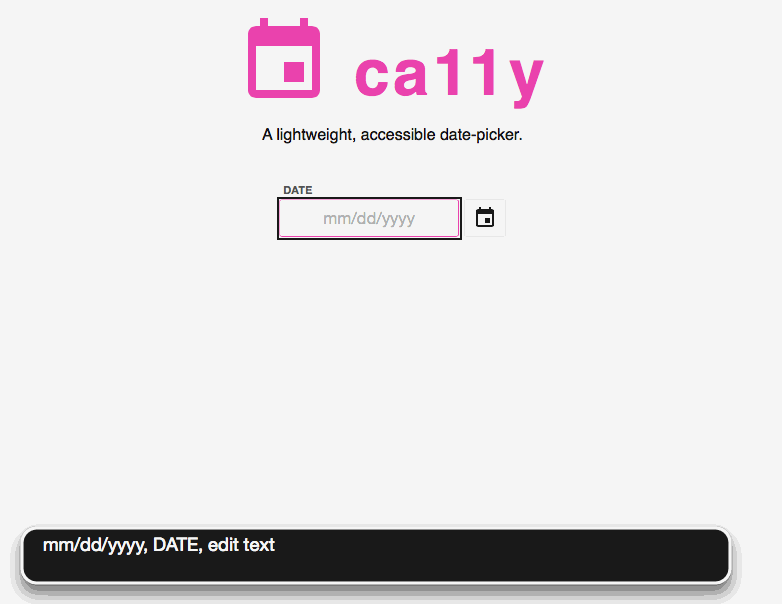

# ca11y [](https://circleci.com/gh/vigetlabs/ca11y/tree/master)

[](https://npmjs.org/package/ca11y)

[](https://waffle.io/vigetlabs/ca11y)

An accessible, light-weight, vanilla date picker `< 6kb` gzipped. Bring your own styles, or play off the [demo](src/demo/theme.sass). 


```
npm install ca11y --save
```


**This is a work in progress.** Accessibility testing thus far has been through basic keyboard usage and Apple VoiceOver on OS X Safari. We would love more testing and advice from the community!



http://code.viget.com/ca11y

Feedback, pull requests, bug reports and ideas for improvement. Got some? Head on over to [issues](https://github.com/vigetlabs/ca11y/issues). 

## Usage

##### Multiple instances by css selector:
```js
import Ca11y from 'ca11y'
Ca11y.init('.date-picker', options)
```

##### Single input element:
```js
import Ca11y from 'ca11y'
const input = document.getElementById('#date-input')
const datePicker = new Ca11y(input, options)
```

Pass any of the [options listed below](#options) to override [the defaults](https://github.com/vigetlabs/ca11y/blob/master/src/ca11y/lib/defaults.js).

##### Styling:

`Ca11y` just provides the markup and functionality. You're on the hook to provide css. Feel free to use the styles from the [demo](src/demo/theme.sass) as a starting point. At the very least, you'll need to something like this to hide the date-picker when inactive:

```sass
.ca11y__picker[aria-hidden="true"] {
  display: none;
}
```

## Options
### Basic
#### `options.format`
```js
const datePicker = new Ca11y(input, {
  format: ['mm', 'dd', 'yyyy'] // default
})
```
A an `Array` of date codes to specify your desired format. Joined with `options.delimiter`. 

Available formats:

 key   | value   
-----------|---------
**d**    | Day of the month as digits; no leading zero for single-digit days.
**dd**   | Day of the month as digits; leading zero for single-digit days.
**ddd**  | Day of the week as a three-letter abbreviation.
**dddd** | Day of the week as its full name.
**m**    | Month as digits; no leading zero for single-digit months.
**mm**   | Month as digits; leading zero for single-digit months.
**mmm**  | Month as a three-letter abbreviation.
**mmmm** | Month as its full name.
**yy**   | Year as last two digits; leading zero for years less than 10.
**yyyy** | Year represented by four digits.


`fullName` and `label` values are read by screen readers. Provide `transitionDuration` if you are using the css `transition` property on the `.ca11y__picker` element to allow auto-focusing of the selected day on transition end.

#### `options.delimiter`
```js
const datePicker = new Ca11y(input, {
  delimiter: "/" // default
})
```
The `String` used to `join` the date segments defined in the `options.format` `Array`.


#### `options.transitionDuration`
```js
const datePicker = new Ca11y(input, {
  transitionDuration: 200 // default
})
```
If you are transitioning open and closing the calendar with CSS, specify the `transitionDuration` in milliseconds here.

#### `options.autofill`
```js
const datePicker = new Ca11y(input, {
  autofill: false // default
})
```
Set to `true` if you want a blank input to be auto-filled with today's date.

#### `options.onSelect`
```js
const datePicker = new Ca11y(input, {
  onSelect: onSelect(input, value, state, date) {
    input.value = value 
  }  // default
})
```
The `function` that runs whenever a date is selected. By default, it sets the input value to the selected date, formatted as defined by `format` and `delimiter`.


### Language
#### `options.months`
```js
const datePicker = new Ca11y(input, {
  months: [
    { fullName: 'January', displayName: 'Jan', shortName: 'Jan' },
    ...
})
```
An `Array` of objects containing the `fullName`, `displayName`, and `shortName` of each month. `fullName` is what gets read by screen readers. `displayName` gets rendered to the calendar, and `shortName` is for usage with output formats. Override with other languages or desired text.

#### `options.days`
```js
const datePicker = new Ca11y(input, {
  days: [
    { fullName: 'Sunday', displayName: 'S', shortName: 'Sun' } ,
    ...
})

Same format as `months`. Override with other languages or desired text.

#### `options.dayTitles`
```js
const datePicker = new Ca11y(input, {
dayTitles: [
  'First',
  'Second',
  ...
})
```
Read aloud by screen readers when a date receives focus. Override with other languages or desired text.

#### `options.dayTitles`
```js
const datePicker = new Ca11y(input, {
dayTitles: [
  'First',
  'Second',
  ...
})
```
Read aloud by screen readers when a date receives focus. Override with other languages or desired text.

#### UI
#### `options.toggle`
```js
const datePicker = new Ca11y(input, {
  toggle: {
    html: '<button>Toggle me!</button>',
    label: 'Toggle Date Picker'
  }
})
```

The `html` will be rendered as the toggle button next to the input. The `label` is screen-reader only. Defaults to `svg` iconography from https://design.google.com/icons/.

#### `options.next`
```js
const datePicker = new Ca11y(input, {
  next: {
    html: '<button>Next</button>',
    label: 'Next Month'
  }
})
```

The `html` will be rendered as the next month button. The `label` is screen-reader only. Defaults to `svg` iconography from https://design.google.com/icons/.

#### `prev`
```js
const datePicker = new Ca11y(input, {
  prev: {
    html: '<button>Prev</button>',
    label: 'Previous Month'
  }
})
```

The `html` will be rendered as the previous month button. The `label` is screen-reader only. Defaults to `svg` iconography from https://design.google.com/icons/.

### Advanced
#### `parser`
[See default.](src/ca11y/lib/parse)

#### `formatter`
[See default.](src/ca11y/lib/format)

### HTML5 Date Inputs and Ca11y

Ca11y upgrades standard text inputs to date-pickers. If you're interested in using the native HTML5 date-picker via `<input type="date">`, consider loading Ca11y based on a feature test, like this one (pulled from Modernizr):

```js
function isDateInputSupported() {
    var input = document.createElement('input')
    input.setAttribute('type', 'date')
    var isDate = input.type !== 'text' && 'style' in input
    var testValue = '1)'
    if (isDate) {
        input.value = testValue
        input.style.cssText = 'position:absolute;visibility:hidden;'
        isDate = input.value != testValue
    }
    return isDate
}
```

## Demo Locally
```
npm install
npm start
```

### Deploy to GitHub Pages
```
npm run deploy
```

--

**Check out other open source work happening at [Viget](http://viget.com) on [code.viget.com](http://code.viget.com)**
